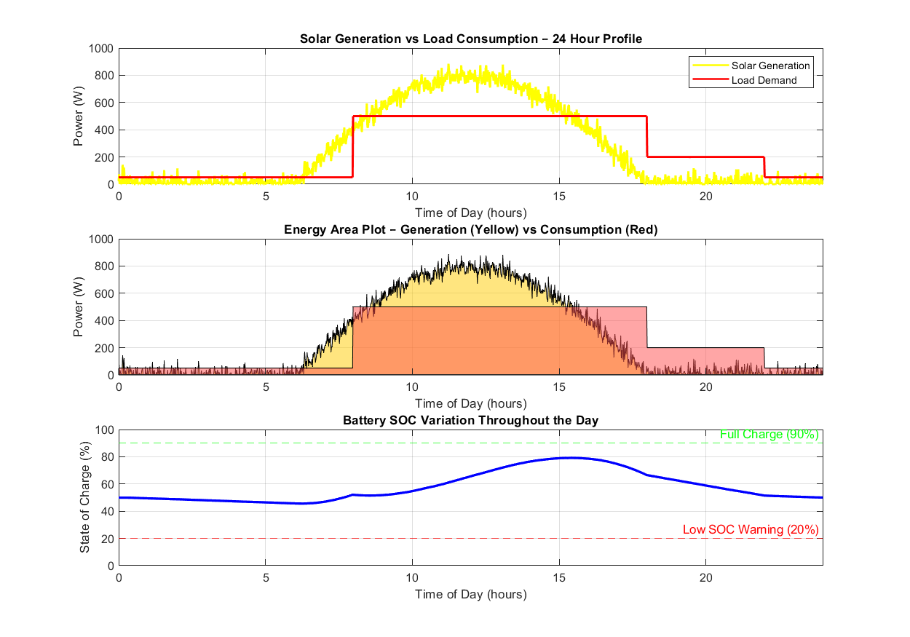

# Solar-Powered IoT Energy Monitoring System

> Embedded Systems | MATLAB | Microsoft Excel | Renewable Energy Integration

## Overview

This project presents the design and simulation of an IoT-based
energy monitoring system for a small-scale solar installation.

The hardware architecture is designed around an ESP32
microcontroller with INA219 current sensors. The 24-hour
operational behaviour is simulated entirely in MATLAB, and
daily KPI reports are generated in Microsoft Excel — replicating
the data pipeline used in real solar O&M (Operations & Maintenance)
workflows.

---

### Component Roles

| Component | Role |
|---|---|
| ESP32 | Main controller, WiFi, ADC reading |
| INA219 | Measures current via shunt resistor over I2C |
| Voltage Divider | Scales panel/battery voltage to ADC range |
| MQTT Broker | Receives and forwards sensor data to cloud |
| ThingSpeak | Cloud dashboard for live graphs and alerts |

## Simulation Methodology

### Solar Generation Model
Panel output follows an irradiance bell curve (6am–6pm):
Irradiance(t) = 1000 × sin(π × (t - 6) / 12)   for 6 ≤ t ≤ 18 = 0 otherwise
Random Gaussian noise (σ = 50 W/m²) added to simulate cloud cover.
Panel power = Irradiance × 1 kWp × PR (0.80)

### Load Profile
| Period | Load |
|---|---|
| 00:00 – 08:00 | 50 W (standby) |
| 08:00 – 18:00 | 500 W (working hours) |
| 18:00 – 22:00 | 200 W (evening lighting) |
| 22:00 – 00:00 | 50 W (standby) |

### Battery SOC — Coulomb Counting
SOC(t) = SOC(t-1) + (Net Power × Δt) / Battery Capacity
Net Power = Solar Power − Load Power
Δt = 1 minute = 1/60 hour
SOC clamped between 0% and 100%.

---

## Outputs


### 24-Hour Power Profile

*Orange line: solar generation (bell curve, peaks ~800W at noon)*
*Red line: load demand (step profile)*
*Where orange > red: battery charges*
*Where red > orange: battery discharges*

### Energy Area Plot


*Overlap region = direct self-consumption (most efficient)*
*Yellow above red = surplus charging battery*
*Red above yellow = load drawing from battery*

### Battery SOC Variation
*Starts at 50%, rises to ~75% during solar peak*
*Drops in evening as load runs on battery alone*
*Green dashed line: 90% full charge threshold*
*Red dashed line: 20% low SOC warning threshold*

---

## Daily KPI Results (Sample Simulation Output)

| KPI | Value |
|---|---|
| Total Solar Generation | 4.2 kWh |
| Total Load Consumption | 3.9 kWh |
| Net Energy Balance | +0.3 kWh |
| Peak Solar Power | ~800 W |
| Minimum Battery SOC | 38% |
| Maximum Battery SOC | 74% |
| Self-Consumption Ratio | 93% |
| Solar Fraction | 100% |

---

## Excel Integration

MATLAB exports 1,440 rows of per-minute data automatically:

```matlab
writetable(T, 'Solar_Monitoring_24hr.xlsx', 'Sheet', 'Raw Data');
```

The Excel workbook contains two sheets:
- **Raw Data:** 1,440 rows × 5 columns (Hour, Solar_W, Load_W, Net_W, SOC_pct)
- **Daily Report:** KPI summary table + 24-hour power chart + SOC flags

---

## Tools Used

| Tool | Purpose |
|---|---|
| MATLAB | 24-hour system simulation, SOC modelling, plotting |
| Microsoft Excel | KPI report, daily summary, O&M dashboard |

---

## Concepts Demonstrated

- Solar IoT system architecture design
- Irradiance-based power modelling with noise
- Coulomb counting for battery SOC estimation
- Self-consumption ratio and solar fraction metrics
- MATLAB to Excel data pipeline using writetable
- O&M reporting format for solar installations

---

## How to Run

1. Open `matlab/solar_monitoring_sim.m` in MATLAB
2. Run the script — 3 figures generate, Excel file exports automatically
3. Open `excel/Solar_Monitoring_24hr.xlsx`
4. Check Raw Data sheet for per-minute simulation data
5. Check Daily Report sheet for KPI summary and chart
